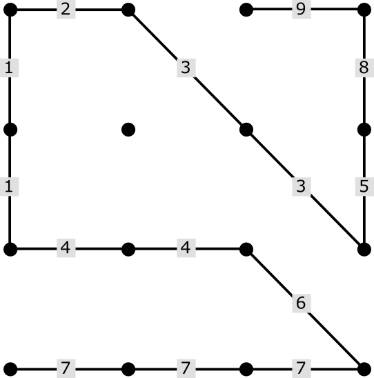

# connecting-the-dots

The Game
A connect-the-dots game for two players.

Definitions
octilinear line - a horizontal, vertical, or 45° diagonal line
Rules
The game is played on a 4x4 grid of 16 nodes.
Players take turns drawing octilinear lines connecting nodes.
Each line must begin at the start or end of the existing path, so that all lines form a continuous path.
The first line may begin on any node.
A line may connect any number of nodes.
Lines may not intersect.
No node can be visited twice.
The game ends when no valid lines can be drawn.
The player who draws the last line is the loser.
Example Game
Each move is numbered. Lines that connect more that two nodes have each segment numbered. Player 1 made the odd numbered moves and Player 2 made the even numbered moves. Player 1 made the first move (1) and was forced to make the last move (9). Thus, Player 2 won.

 

Attribution
The game was designed by Sid Sackson.

a)Introduction

There must be total five files in the server folder 
The four essential files to run the game server are:
1. index.js 	This file contains the server
2. app.js  	    This file contains logic
3. actions.js 	This file contains the Json Responses
4. package.json	This file contains the description and dependancies.

b)Installation

Instructions to start the server
1. To run this server you need to have Node.js installed on your system

2. Navigate to this server folder which contails all the 6 files after extracting the zip file.

3. open cmd/terminal at this folder location and write npm install and hit enter/return it will install all the dependancies which are express.js and cors

4. install Visual Studio Code code and live server extention for serving the client page. 

c)Usage

1. Open cmd/terminal and write npm start or node index.js and hit enter/return to start the game server.

2. navigate to the client folder in Visual Studio Code and open index.html with live server.

3. start playing the game.

4. game state logs can be found in cmd/terminal.

game server created by Abhijit.